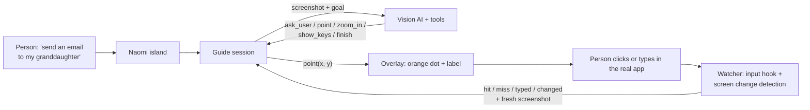

# Naomi

**You don't need to know how to use a computer. You just need to know what you want to do.**

Naomi is a patient, visual companion for people who find computers hard. Tell her what you want to do. She asks only what she needs, then points at the exact spot on your real screen, one step at a time, until it's done.

## Download

Get **Naomi-Setup-0.1.0.exe** from the [Releases](https://github.com/AuvroIslam/Naomi/releases) page, double-click it, and Naomi opens in a few seconds. No account, no setup, no API key to enter.

Windows may say "Windows protected your PC" because the app isn't signed. Click **More info**, then **Run anyway**.

## The problem

Millions of people, our parents and grandparents among them, know exactly **what** they want to do:

> "I want to send an email to my granddaughter."

What they don't know is **how**: which app, which button, what an "address bar" is. Tutorials assume words they don't know. Videos go too fast. Family isn't always around. So they give up, or feel embarrassed to ask.

## What Naomi does

Naomi feels like a patient person sitting beside you, pointing at the screen.

1. **You say your goal** in your own words, typed or spoken.
2. **Naomi works out what the task needs.** An email needs an address, so she asks for it. She never asks what you want to write; she simply shows you where to write it.
3. **An orange dot glides to the exact spot** on your real screen: "Click here to write a new email."
4. **Naomi watches what you do.** Right click? "Good." Something else? "That's okay. Let's try this one." She adapts to where you are instead of following a script.
5. **She stays with you until it's actually done**, then celebrates with you.

Naomi never controls your computer. **You** do every click. She just shows you where.

## Highlights

| Feature | What it means |
|---|---|
| **Points at your real screen** | Not a tutorial or a simulation. A transparent overlay puts the dot on the actual button in whatever app you're using. |
| **Understands the whole goal** | Asks for missing information one simple question at a time, and never assumes things you didn't say. |
| **Sees what you did** | Knows when you clicked, typed, or the screen changed, and checks the result before the next step. |
| **Looks closer** | Zooms into small or crowded areas and double checks its aim before pointing. |
| **Understands real apps** | Knows that Gmail turning an address into a contact name means it worked, and that the message goes in the big box, not the Subject line. |
| **Checks before sending** | Before Send, Pay, Delete, or Install, confirms everything is really in place. |
| **Remembers for next time** | Saves helpful facts like a family member's email address, only on your computer, erasable in one tap. Never passwords or card numbers. |
| **Watches out for you** | Gently warns about scams: gift card requests, fake virus popups, strangers asking for remote access. |
| **Speaks every step** | Reads each instruction aloud in a calm female voice, fully offline. |
| **Calm, minimal design** | A small dark glass island at the top of the screen, inspired by Apple's Dynamic Island. It grows only when Naomi needs to talk. |
| **Stays out of the way** | Clicks pass straight through to your apps. Taskbar targets get the dot just above the taskbar with an arrow. |
| **Safe practice mode** | A pretend email app where first timers can practise. Nothing is really sent. |

## How it works



* **Electron** app with two windows: the Naomi island (only the pill takes clicks) and a full screen, click-through overlay that draws the pointer and spotlight above every app.
* **A vision AI** sees a screenshot and replies with exactly one tool call per turn. Coordinates are mapped from screenshot pixels to real screen positions, DPI aware.
* **The watcher** listens to global mouse and keyboard events (never what you type) and samples tiny screen fingerprints to know when an action happened and the screen has settled.
* **Aim check:** before pointing, Naomi looks at a magnified crop of its target to confirm it's on the right element.

## AI providers

Naomi tries each provider that has a key, in this order, and quietly moves on if one is unavailable:

| Order | Provider | Model | Key |
|---|---|---|---|
| 1 | OpenAI | `gpt-5.4-mini` | `OPENAI_API_KEY` |
| 2 | DeepSeek | `deepseek-v4-flash-vision-exp` | `DEEPSEEK_API_KEY` |
| 3 | Google | `gemini-3.6-flash` (free tier) | `GEMINI_API_KEY` |
| 4 | Anthropic | `claude-opus-5` | `ANTHROPIC_API_KEY` |

Any key can have a spare: add `_FALLBACK` to its name (for example `GEMINI_API_KEY_FALLBACK`). People using Naomi are never asked for a key. Whoever builds it fills in `.env` once, and the installer carries it.

## Run from source

Requires Windows 10 or 11 and Node.js 20+.

```bash
git clone https://github.com/AuvroIslam/Naomi.git
cd Naomi
npm install
copy .env.example .env   # add at least one key
npm start
```

| Command | What it does |
|---|---|
| `npm start` | Run Naomi |
| `npm start -- --practice` | Open practice mode |
| `npm run mock` | Run with a scripted offline brain, for UI work |
| `npm run check` | One live call to confirm your keys work |
| `npm test` | Run the unit tests |
| `npm run dist` | Build the installer and portable app into `dist/` |

Press **Ctrl + Alt + N** any time to bring Naomi back.

## Privacy and safety

* Screenshots go only to the AI provider to decide the next step. Naomi stores nothing on any server.
* Naomi never clicks or types for you, and never asks for passwords, PINs, or card numbers.
* The input hook notices only *that* a key was pressed or *where* a click happened, never what you typed.
* Memories live in a local file and can be erased from Settings.

## Roadmap

* macOS support
* Multi-monitor pointing
* Family helper mode, so a relative can follow along and help remotely
* More languages

## License

MIT
