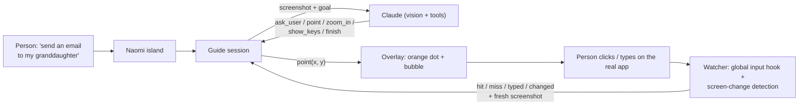

<p align="center">
  
</p>

<h1 align="center">Naomi</h1>

<p align="center"><b>You don't need to know how to use a computer.<br/>You just need to know what you want to do.</b></p>

<p align="center">
  A patient, visual companion for people who find computers hard.<br/>
  Tell Naomi what you want to do — she asks what she needs to know, then <b>points at the exact spot on your real screen</b>, one step at a time, until it's done.
</p>

---

## The problem

Millions of people — our parents, grandparents, and anyone who didn't grow up with computers — know exactly **what** they want to do:

> "I want to send an email to my granddaughter."

What they don't know is **how**: which app, which button, what an "address bar" is. Tutorials assume vocabulary they don't have. Videos go too fast. Family members aren't always around. So they give up, or feel stupid for asking.

## What Naomi does

Naomi feels like a patient person sitting beside you, pointing at the screen:

1. **You say your goal** in your own words — typed, or spoken with Windows voice typing.
2. **Naomi understands what the whole task needs.** Emailing your granddaughter needs her email address, so Naomi asks — *"Do you know her email address?"* — and if you don't, helps you find it (*"Have you emailed her before? We can find it in an old email."*).
3. **A friendly orange dot glides to the exact spot** on your real screen — *"Click here to write a new email."*
4. **Naomi watches what you do.** Clicked the right thing? *"Good!"* Clicked something else? *"That's okay. Let's try this one."* She adapts to where you are now instead of following a script.
5. **Until it's actually done** — with a little celebration at the end.

It never controls your computer. **You** do every click. Naomi just shows you where.

## Highlights

| | |
|---|---|
| 🎯 **Points at your real screen** | Not a tutorial or a simulation — a transparent overlay puts the dot on the actual button in whatever app you're using. |
| 🧠 **Understands the goal, not just the next click** | Works out what information is missing (an email address, which app you use) and asks for it simply, one question at a time. |
| 👀 **Sees what you did** | Global click and keyboard awareness plus screen-change detection: instant *"Good!"* on the right click, and kind recovery when things go differently. |
| 🔍 **Looks closer when it's small** | Naomi can zoom into a crowded part of the screen at full resolution before pointing, for pixel-precise guidance. |
| 📝 **Remembers for next time** | *"I'll remember Alysa's email for next time."* Facts are stored only on your computer — never passwords or card numbers — and can be erased in one tap. |
| 🛡️ **Watches out for you** | Gently warns about scams — gift-card requests, fake virus popups, strangers asking for remote access. |
| 🗣️ **Speaks and listens** | Reads every instruction aloud; the 🎤 button opens Windows voice typing. Answers in your language, including Bangla. |
| 🤝 **Designed for patience** | Big text, big buttons, "Show me again", "I'm stuck", no jargon, no judgement. Never says "wrong". |
| 🏝️ **A calm little island** | Naomi lives in a small pill at the top of your screen, like a phone's Dynamic Island. It grows only when she needs to ask you something, and shrinks back while the dot does the pointing. |
| 🫥 **Stays out of the way** | If Naomi needs to point at something under her island, it glides to the bottom of the screen. Everywhere else, clicks pass straight through to your apps. |
| 🎓 **Safe practice mode** | A pretend email app where first-timers can practise with Naomi — nothing is really sent, and no setup or API key is needed. |

## How it works



- **Electron** app with two windows: the Dynamic-Island-style **Naomi island** (a transparent window where only the pill takes clicks) and a full-screen, click-through **overlay** that draws the pointer, spotlight, and speech bubble above every app.
- **Claude** (`claude-opus-5`) sees a screenshot (Naomi hides herself for a blink so Claude sees only your screen) and replies with exactly one tool call per turn: `ask_user`, `point`, `zoom_in`, `show_keys`, or `finish`. Coordinates are mapped from screenshot pixels to real screen positions, DPI-aware.
- The **watcher** listens to global mouse/keyboard events (no keystroke contents are recorded) and samples tiny screen fingerprints to know when an action happened and when the screen has settled — then Naomi takes a fresh look and decides the next step.
- Conversation history is append-only with prompt caching, so each step stays fast.

## Getting started

Requirements: Windows 10/11, Node.js 20+, and an API key from any one of the AI providers below.

```bash
git clone https://github.com/AuvroIslam/Naomi.git
cd Naomi
npm install
npm start
```

People using Naomi are **never asked for an API key**. Whoever builds Naomi copies `.env.example` to `.env` and fills in the keys once; `npm run dist` bundles that `.env` into the installer. (Anyone with the installer can extract those keys, so use keys with spending limits — or just the free Google key.)

### Choose your AI

Naomi tries every provider you've given a key for, **in this order**, and quietly moves on if one isn't available (bad key, no credit, model busy):

| # | Provider | Model | Key | Cost |
|---|---|---|---|---|
| 1 | OpenAI | `gpt-5.4-mini` | `OPENAI_API_KEY` | paid |
| 2 | DeepSeek | `deepseek-v4-flash-vision-exp` (DeepSeek's vision model, experimental) | `DEEPSEEK_API_KEY` | paid, cheap |
| 3 | Google | `gemini-3.6-flash`, then `gemma-4-31b-it` | `GEMINI_API_KEY` | **free tier** ([get a key](https://aistudio.google.com/apikey)) |
| 4 | Anthropic | `claude-opus-5` | `ANTHROPIC_API_KEY` | paid |

**No money? Use Google.** Gemini Flash is free, sees screenshots well, and is the best free option for precise pointing (Gemma 4 is the backup on the same free key). Models can be swapped with `NAOMI_OPENAI_MODEL`, `NAOMI_DEEPSEEK_MODEL`, `NAOMI_GOOGLE_MODEL`.

| Command | What it does |
|---|---|
| `npm start` | Run Naomi |
| `npm start -- --practice` | Jump straight into practice mode (no API key needed) |
| `npm run mock` | Run with a scripted offline brain that points at fixed spots — for UI development |
| `npm run check` | One live call to Claude to confirm your key and setup work |
| `npm test` | Unit tests (geometry, pixel ops, guide session, action watcher, memory, practice guide) |
| `npm run dist` | Build a Windows installer and a portable `.exe` into `dist/` |

Press **Ctrl + Alt + N** any time to bring Naomi back.

## Privacy & safety

- Screenshots go only to the Claude API to decide the next step; nothing is stored on a server by Naomi.
- Naomi never types or clicks for you, and never asks for passwords, PINs, or card numbers. When a password is needed she points at the box and lets you type it privately.
- The input hook only notices *that* a key was pressed or *where* a click happened — never what you typed.
- Memories live in a local file on your computer and can be erased from Settings.

## Roadmap

- macOS support
- Multi-monitor pointing
- Family helper mode: a relative can see progress and help remotely
- Offline speech in more languages

## License

MIT
