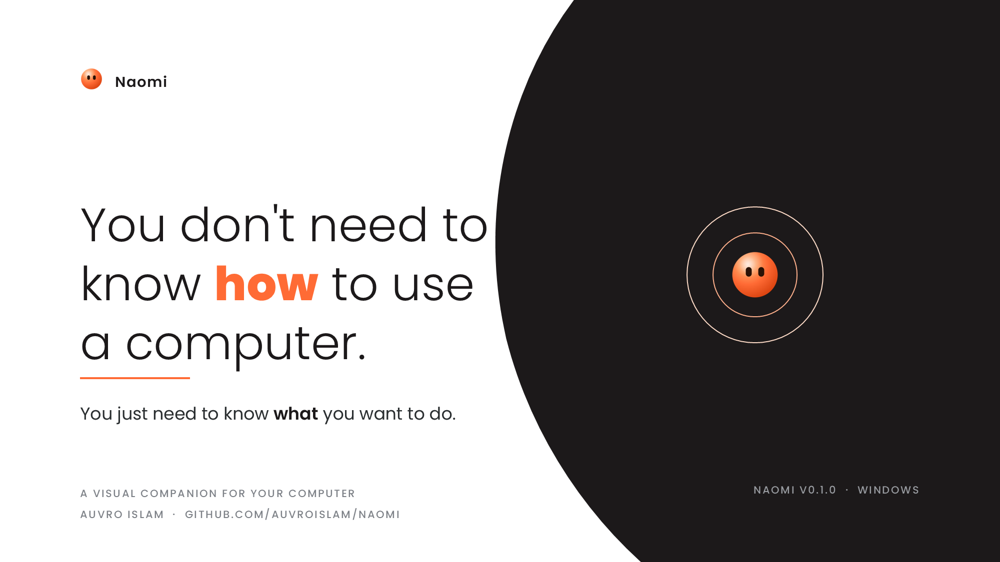
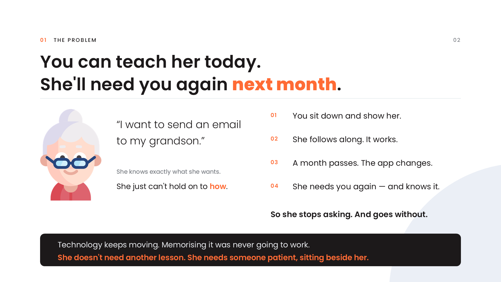
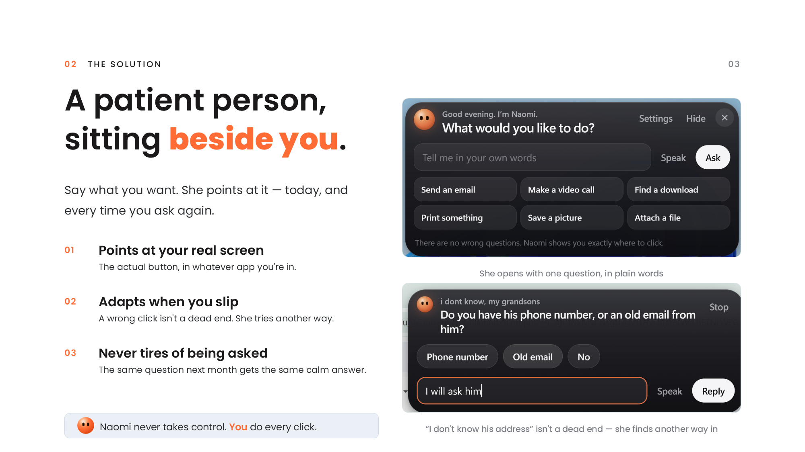
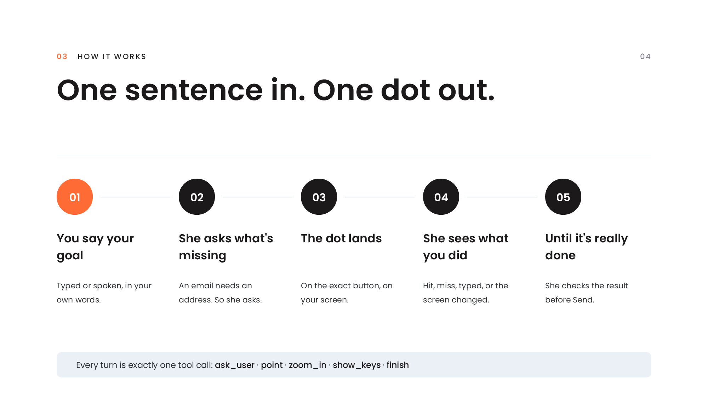
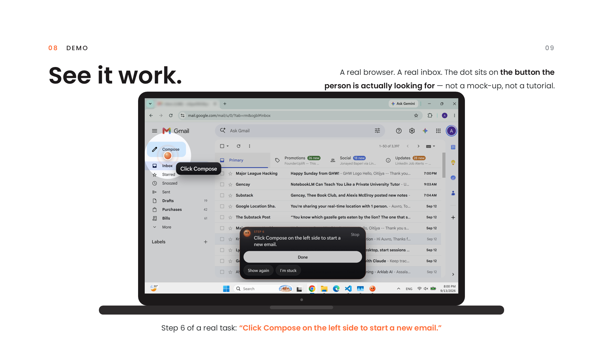
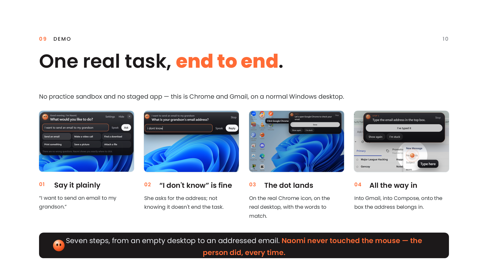
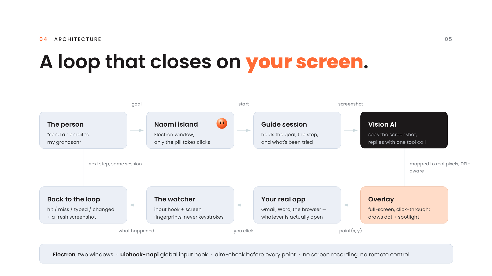
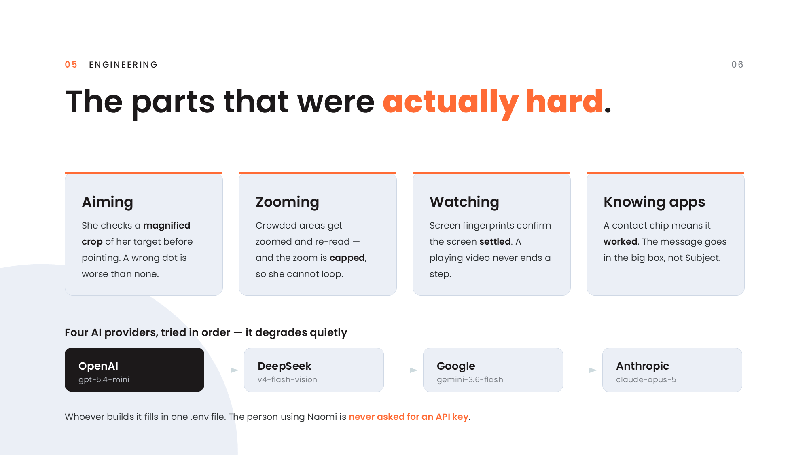
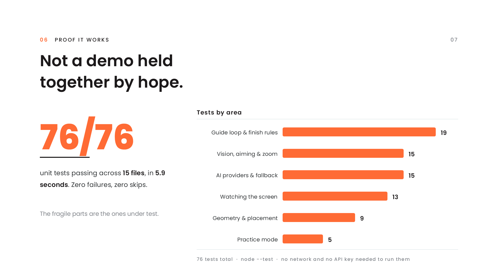
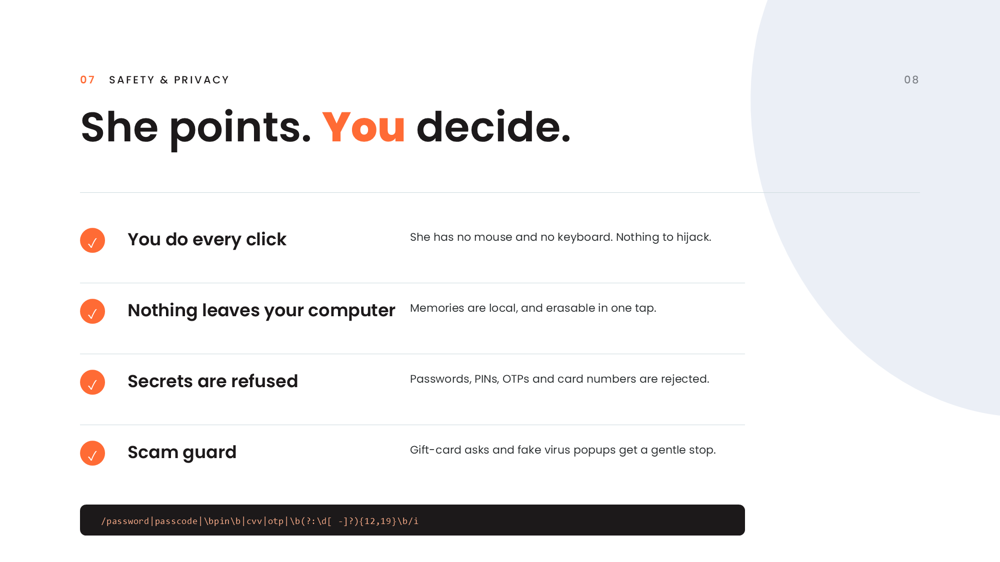

<p align="center">
  
</p>

<h1 align="center">Naomi</h1>

<p align="center">
  <strong>You don't need to know how to use a computer.<br>
  You just need to know what you want to do.</strong>
</p>

Naomi is a patient, visual companion for people who find computers hard. Tell her what you want to do in your own words. She works out what the task needs, asks only for what's missing, then points at the exact spot on your real screen, one step at a time, until it's done.

Ask her the same thing next month and she will answer exactly the same way. She never takes control. You do every click.



## Download

Get **Naomi-Setup-0.1.0.exe** from the [Releases](https://github.com/AuvroIslam/Naomi/releases) page and double-click it. No account, no setup, no API key to enter.

Windows may warn that the app is unsigned. Choose **More info**, then **Run anyway**.

Requires Windows 10 or 11. Press **Ctrl + Alt + N** at any time to bring Naomi back.

## The problem

Your grandmother does not need to be taught. She has been taught. You sat down with her last month, showed her how to send an email, and it worked — she followed along fine.

Then the app updated. A button moved. A month went by. Now she needs you again, she knows it, and asking a fifth time is the part that stops her. So she goes without.

Technology keeps moving. Memorising it was never going to work. What she needs is not another lesson; it is someone patient sitting beside her, who never minds being asked again.



## What Naomi does

Naomi is that person, and she is never busy, never rushed, and never tired of the question.



## How it works



## See it work

A real browser, a real inbox, a real click. Naomi runs above every window, so the dot lands on the button the person is actually looking for.



One task, start to finish: state the goal, answer a question, follow the dot into Chrome, into Gmail, into the box the address belongs in.



## Architecture

Two Electron windows: the Naomi island, where only the pill takes clicks, and a full-screen click-through overlay that draws the dot and spotlight above every app. A vision model sees a screenshot and replies with exactly one tool call per turn. Coordinates are mapped from screenshot pixels to real screen positions, DPI aware.



The watcher listens to global mouse and keyboard events and samples tiny screen fingerprints, so Naomi knows an action happened and the screen has settled before she moves on. It records only that a key was pressed or where a click landed, never what you typed.



## Tested



Run them yourself with `npm test`. They need no network and no API key.

## Safety and privacy



Screenshots go to the AI provider only to decide the next step; nothing is stored on any server. Memories live in a local file and can be erased from Settings.

## AI providers

Naomi tries each provider that has a key, in this order, and quietly moves on if one is unavailable.

| Order | Provider | Model | Key |
|---|---|---|---|
| 1 | OpenAI | `gpt-5.4-mini` | `OPENAI_API_KEY` |
| 2 | DeepSeek | `deepseek-v4-flash-vision-exp` | `DEEPSEEK_API_KEY` |
| 3 | Google | `gemini-3.6-flash` | `GEMINI_API_KEY` |
| 4 | Anthropic | `claude-opus-5` | `ANTHROPIC_API_KEY` |

Any key can have a spare: add `_FALLBACK` to its name, for example `GEMINI_API_KEY_FALLBACK`. People using Naomi are never asked for a key. Whoever builds it fills in `.env` once, and the installer carries it.

## Run from source

Requires Node.js 20 or newer.

```bash
git clone https://github.com/AuvroIslam/Naomi.git
cd Naomi
npm install
copy .env.example .env   # add at least one key
npm start
```

| Command | What it does |
|---|---|
| `npm start` | Run Naomi |
| `npm start -- --practice` | Open practice mode, a pretend email app for first-timers |
| `npm run mock` | Run with a scripted offline brain, for UI work |
| `npm run check` | One live call to confirm your keys work |
| `npm test` | Run the unit tests |
| `npm run dist` | Build the installer and portable app into `dist/` |

## Roadmap

macOS support. Multi-monitor pointing. A family helper mode, so a relative can follow along and help remotely. More languages.

## License

MIT
